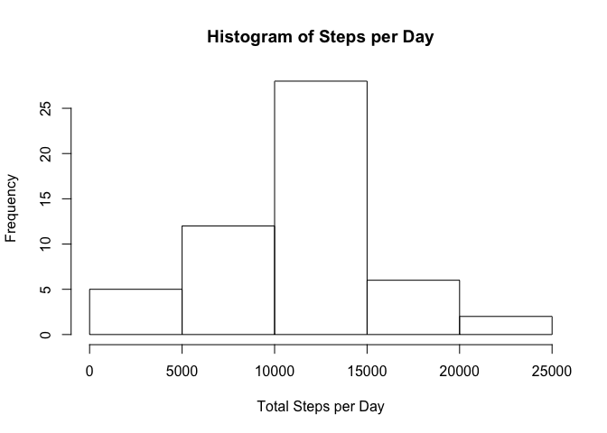
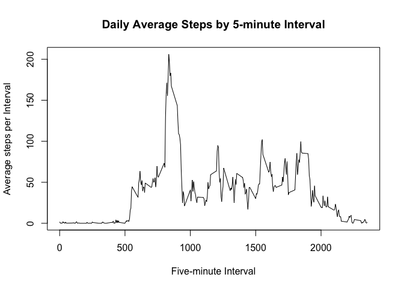
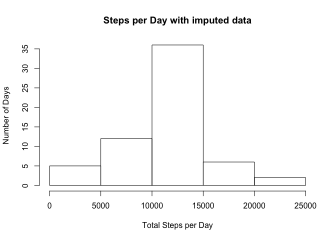
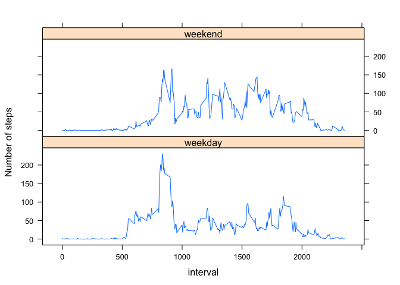

## Loading and preprocessing the data

```r
#First, determine if the file exists in the working directory. If not, download the file. Then unzip.

if(!file.exists("repdata_data_activity.zip")){
    download.file("https://d396qusza40orc.cloudfront.net/repdata%2Fdata%2Factivity.zip","repdata_data_activity.zip")}
unzip("repdata_data_activity.zip")
```


```r
#read in the activity data, format the date and view the top few records

activity<-read.csv("activity.csv", header=TRUE)
activity$date=as.Date(activity$date, "%Y-%m-%d")
head(activity)
```

```
##   steps       date interval
## 1    NA 2012-10-01        0
## 2    NA 2012-10-01        5
## 3    NA 2012-10-01       10
## 4    NA 2012-10-01       15
## 5    NA 2012-10-01       20
## 6    NA 2012-10-01       25
```

## What is mean total number of steps taken per day?

#### 1. Calculate the total number of steps taken per day

```r
steps_daily<-aggregate(steps ~ date, data = activity, sum)
```

#### 2. Make a histogram of the total number of steps taken each day

```r
hist(steps_daily$steps, xlab="Total Steps per Day", main="Histogram of Steps per Day")
```

<!-- -->

#### 3. Calculate and report the mean and median of the total number of steps taken per day

```r
mean(steps_daily$steps, na.rm=TRUE)
```

```
## [1] 10766.19
```

```r
median(steps_daily$steps, na.rm=TRUE)
```

```
## [1] 10765
```

## What is the average daily activity pattern?

#### 1. Make a time series plot of the 5-minute interval and the average number of steps taken, averaged across all days

```r
steps_by_interval<-aggregate(steps~interval, data=activity, mean)
plot(steps_by_interval$interval, steps_by_interval$steps, type="l", xlab="Five-minute Interval", ylab="Average steps per Interval", main="Daily Average Steps by 5-minute Interval")
```

<!-- -->

#### 2. Which 5-minute interval, on average across all the days in the dataset, contains the maximum number of steps?

```r
steps_by_interval[which.max(steps_by_interval$steps), "interval"]
```

```
## [1] 835
```

## Imputing missing values

#### 1. Calculate and report the total number of missing values in the dataset (i.e. the total number of rows with NAs)

```r
sum(is.na(activity$steps))
```

```
## [1] 2304
```

#### 2. Devise a strategy for filling in all of the missing values in the dataset. The strategy does not need to be sophisticated. For example, you could use the mean/median for that day, or the mean for that 5-minute interval, etc.

```r
#To impute for missing values, we will replace the NA with the calculated mean for that particular 5-minute interval
impute.mean<-function(x) replace(x, is.na(x), mean(x, na.rm=TRUE))
```

#### 3. Create a new dataset that is equal to the original dataset but with the missing data filled in.

```r
library(magrittr)
library(dplyr)
```

```
## 
## Attaching package: 'dplyr'
```

```
## The following objects are masked from 'package:stats':
## 
##     filter, lag
```

```
## The following objects are masked from 'package:base':
## 
##     intersect, setdiff, setequal, union
```

```r
imputed_activity<- activity %>% group_by(interval) %>% mutate(steps = impute.mean(steps))
```

#### 4. Make a histogram of the total number of steps taken each day and Calculate and report the mean and median total number of steps taken per day. Do these values differ from the estimates from the first part of the assignment? What is the impact of imputing missing data on the estimates of the total daily number of steps?

```r
imputed_steps_daily <- aggregate(steps ~ date, data = imputed_activity, sum)
hist(imputed_steps_daily$steps, xlab = "Total Steps per Day", ylab = "Number of Days", main = "Steps per Day with imputed data")
```

<!-- -->

```r
mean(imputed_steps_daily$steps)
```

```
## [1] 10766.19
```

```r
median(imputed_steps_daily$steps)
```

```
## [1] 10766.19
```

```r
# Compare to previous mean/median, from data set with missing values
mean(steps_daily$steps, na.rm=TRUE)
```

```
## [1] 10766.19
```

```r
median(steps_daily$steps, na.rm=TRUE)
```

```
## [1] 10765
```

```r
# The mean stays the same as expected, since the missing daily values were replaced with the mean. The median drew closer to the mean, as the missing values were replaced with the mean.
```

## Are there differences in activity patterns between weekdays and weekends?
#### 1. Create a new factor variable in the dataset with two levels – “weekday” and “weekend” indicating whether a given date is a weekday or weekend day.

```r
imputed_activity$weekend=""
imputed_activity[which(weekdays(imputed_activity$date) %in% c("Saturday","Sunday")), "weekend"]<-"weekend"
imputed_activity[which(weekdays(imputed_activity$date) %in% c("Monday","Tuesday","Wednesday","Thursday","Friday")), "weekend"]<-"weekday"
imputed_activity$weekend <- as.factor(imputed_activity$weekend)
head(imputed_activity)
```

```
## # A tibble: 6 x 4
## # Groups:   interval [6]
##    steps date       interval weekend
##    <dbl> <date>        <int> <fct>  
## 1 1.72   2012-10-01        0 weekday
## 2 0.340  2012-10-01        5 weekday
## 3 0.132  2012-10-01       10 weekday
## 4 0.151  2012-10-01       15 weekday
## 5 0.0755 2012-10-01       20 weekday
## 6 2.09   2012-10-01       25 weekday
```


#### 2. Make a panel plot containing a time series plot of the 5-minute interval (x-axis) and the average number of steps taken, averaged across all weekday days or weekend days (y-axis). 

```r
library(lattice)
steps_by_interval<-aggregate(imputed_activity$steps, list(interval = imputed_activity$interval, weekend = imputed_activity$weekend), mean)
xyplot(x ~ interval | weekend, data = steps_by_interval, layout = c(1,2), type = "l", ylab = "Number of steps")
```

<!-- -->
